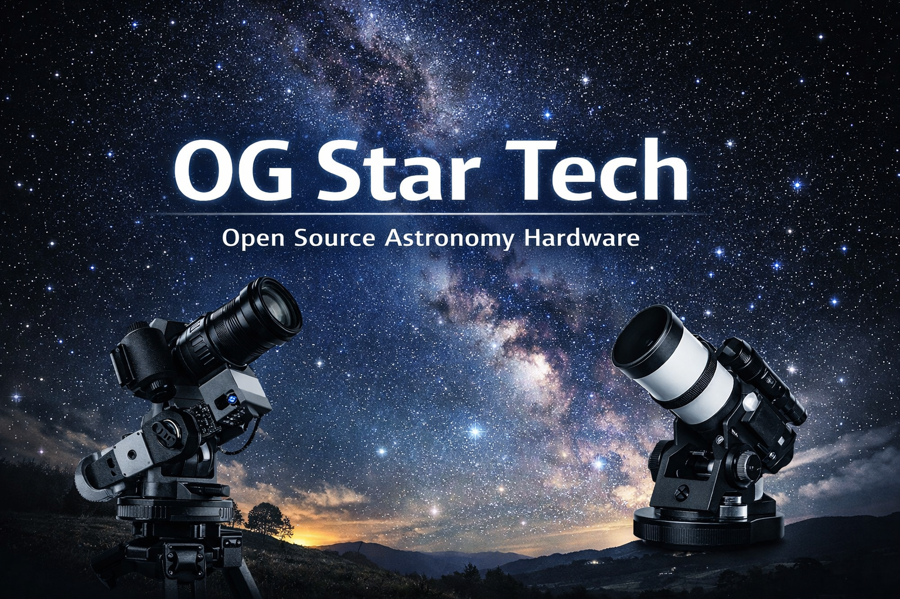

# OG Star Tech

**[English](README.md) | 中文**

---

**开源天文设备与工具**

我们是一个规模不大的开源社区，专注于构建实用、可负担的天文工具，尤其是那些任何人都可以学习、修改和改进的硬件项目。

很多项目最初源于一个很简单的想法：  
许多天文设备价格高昂、封闭，且难以定制。  
我们希望有一种更便携、更经济、更开放的解决方案，于是开始自己动手制作。

随着时间推移，这些个人项目逐渐发展成一系列开源设计、固件和相关工具，供他人使用、学习和改进。

我们仍在学习，也仍在不断改进，欢迎任何愿意参与的人加入。

---

# 我们在做什么

我们的项目主要集中在：

**开源天文摄影硬件、固件及相关工具**

---

## ⭐ OG Star Tracker

项目地址：  
https://github.com/OG-star-tech/OG-star-tracker-

**OG Star Tracker** 是一个完全可3D打印、可升级的天文跟踪器，主要用于天文摄影。

设计目标包括：

- 成本可控  
- 便于携带  
- 模块化结构  
- 允许自由修改  

项目内容包括：

- 机械结构设计文件  
- 固件  
- 电路与电子文档  
- 装配指南  
- 社区升级方案  

---

## 🔭 OGScope

项目地址：  
https://github.com/OG-star-tech/OGScope

**OGScope** 是一个实验性的开源望远镜相关项目。

与这里的大多数项目一样，它仍在持续演进。

你可能会看到：

- 未完成的想法  
- 原型设计  
- 持续改进的结构  

社区反馈对这个项目尤其重要。

---

# 文档

📚 https://wiki.ogstartech.cn/

Wiki 中包含：

- 装配指南  
- 固件文档  
- 硬件原理说明  
- 故障排查记录  

文档仍在不断完善，欢迎贡献内容。

---

# 我们的理念

我们相信：

- 硬件应该是可以理解的  
- 工具应该是可以修改的  
- 知识应该被共享  
- 改进应该来自协作  

我们并不追求完美。  
很多部分仍然是实验性的。

这正是开源的一部分。

---

# 如何参与

我们欢迎各种形式的贡献：

- 代码  
- 结构设计  
- 文档完善  
- 测试反馈  
- 翻译  

基本流程：

1. Fork 项目  
2. 修改代码或设计  
3. 提交 Pull Request  
4. 说明你的修改内容  

即使是很小的改进，也非常有价值。

---

# License

每个项目包含各自的许可证。

许多硬件相关内容使用：

**CC BY-NC-SA 4.0**

请查看具体仓库中的说明。

---

# 致谢

开源之所以能够存在，是因为有人愿意贡献时间和精力。

感谢每一位：

- 构建项目的人  
- 提出问题的人  
- 分享经验的人  
- 提供改进的人  

每一份贡献都值得尊重。